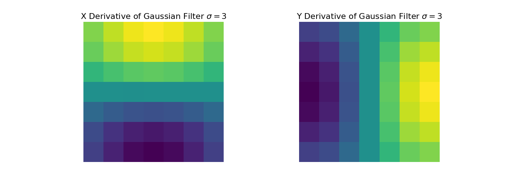
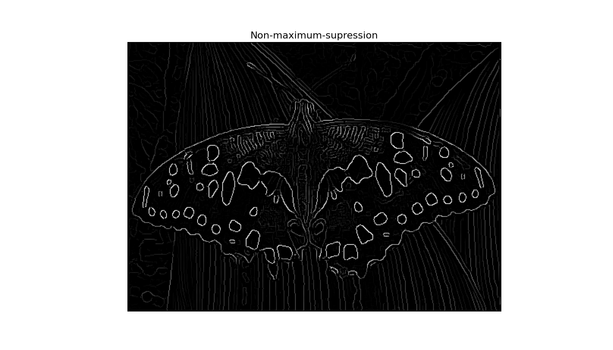
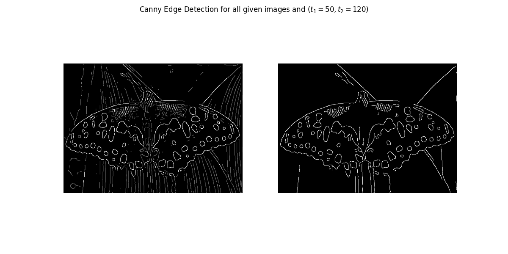
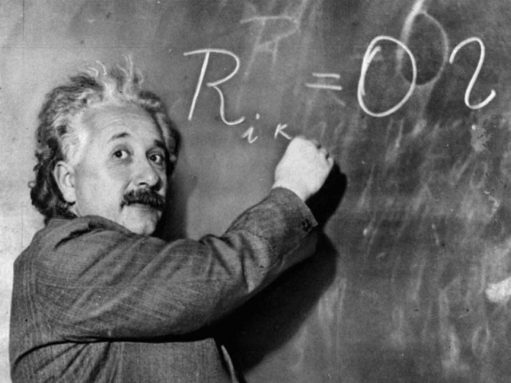
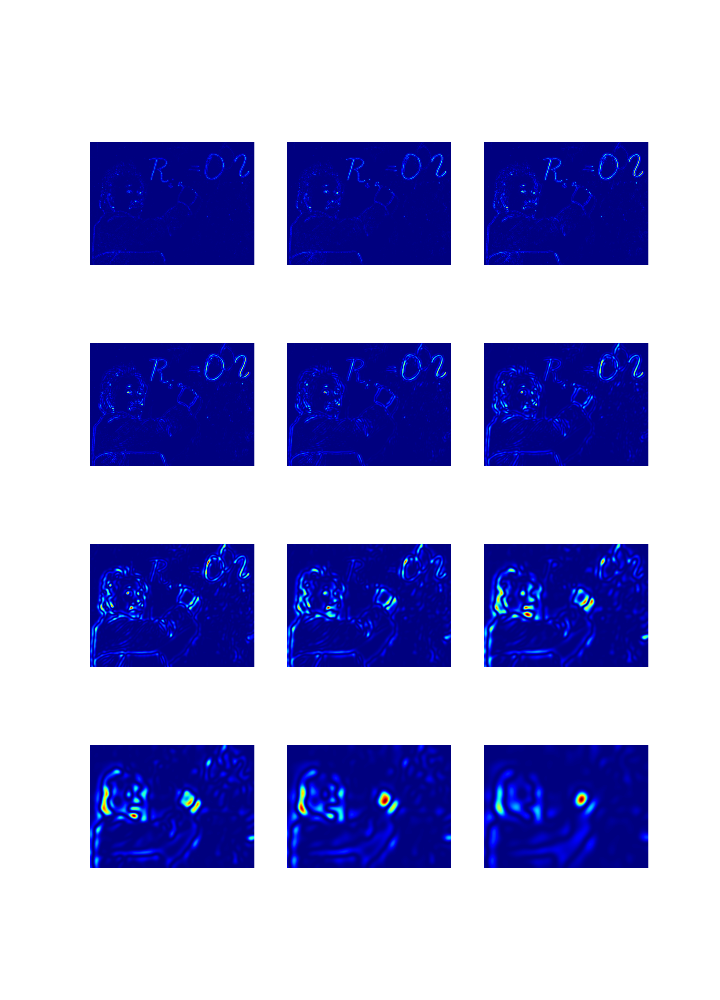
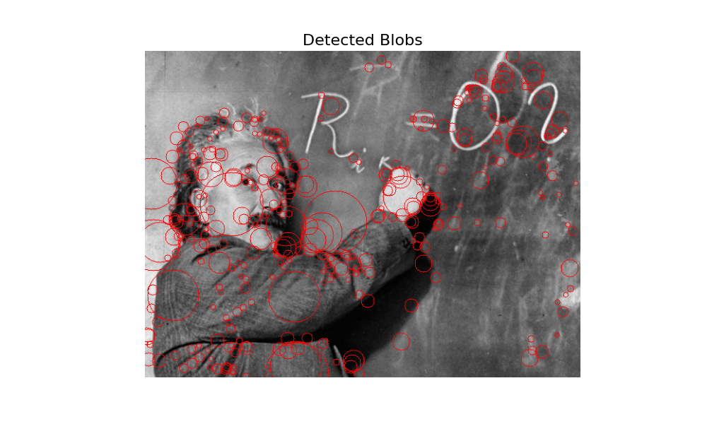

# Canny Edge Detection and Blob Detection

<p align="center">
  
</p>

[](LICENSE)
[](https://github.com/username/project/actions)

## Description
1. **_PartA_:**
  Canny Edge Detection from scratch

2. **_PartB_:**
   Blob Detection at different scales and rejection of Harris Corners.
 


## Table of Contents
- [Part A](#Part_A)
  - [Sobel Filters and Convolutions](#sobel-filters-and-convolutions)
  - [Non-Maxima-Supression](#non-maxima-supression)
  - [Canny Algorithm](#canny-algorithm)
  - [Installation](#installation)
  - [Execution](#execution)
- [Part B](#part-b)
  - [Difference of Gaussians](#difference-of-gaussians)
  - [Non-Maxima-Supression Across Scales](#non-maxima-supression-across-scales)
- [License](#license)

## Part_A

### Sobel Filters and Convolutions

We are first given a simple image like:

<p align="center">
  
</p>

Then, we want to convolve the image with SobelX and SobelY filters to acquire the gradients along the two dimensions. The Sobel filters are of the following form:

<p align="center">
  
</p>

After we apply the convolutions we acquire the feature maps which are of the following form:

<p align="center">
  
</p>

Note that one filter triggers on Vertical edges and the other on Horizontal.

One can get the gradient magnitude at any given point using the following formula:

<div align="center" style="font-size: 12px;">
  
$$
magn = \sqrt{{\frac{dI}{dx}}^2 + {\frac{dI}{dy}}^2}
$$

</div>

### Non-Maxima-Supression

Having performed the convolutions we then extract the gradient magnitudes and orientations and non-maxima-supression is performed where only local gradient maximum pixels are kept along the orientation of the gradient. This leads to the following output:

<p align="center">
  
</p>

### Canny Algorithm

The Canny Edge detection algorithm takes an input image, performs Sobel convolutions and non-maxima-supression to extract candidate edges and then categorizes the edge pixels based on their gradient magnitude into three categories:

1. Definitely Edges (magn > t2)
2. Candidate Edges (t1 < magn <= t2)
3. Not Edges (magn < t1)

Finally, it performs a connected component analysis to keep only those edges that have at least one pixel belonging to category 1.

A sample output of the Canny Edge detector on the input butterfly image is as follows:

<p align="center">
  
</p>

### Installation

First create a virual environment by running:

1. Using _Conda_:
  ```bash
  conda create <your_environment_name>
  ```
2. Using _venv_
```bash
python -m venv <your_environment_name>
```

Then, activate your environment:

1. Using _Conda_:
  ```bash
  conda activate <your_environment_name>
  ```

2. Using _venv_:
   ```bash
   cd <your_environment_name>/bin
   source ./activate ## For Linux
   cd ../..
   ```
   or
   ```bash
    cd <your_environment_name>/Scripts
    activate  ## For Windows
    cd ../..
   ```

 Finally, install the requirements.txt file:

 ```bash
 pip install -r requirements.txt
 ```

### Execution

Run:
```bash
python Canny_Edge_detection.py data/sample_input/butterfly.jpg <your_output_folder>
```
To reproduce the result above or

```bash
python Canny_Edge_detection.py path/to/your/image output_folder_name
```
if you want to provide your own image.


## Part B

Blob detection aims at detecting distinct feature-rich points in an image, while also maintaining scale invariance.
Let's say we have the following input image of Einstein:

<p align="center">
  
</p>

### Difference of Gaussians

To extract and detect blobs a difference of gaussians (DoG) or Laplacian kernel is used.

The application of these kernels at different scales leads to the following feature maps:

<p align="center">
  
</p>

### Non-Maxima-Supression Across Scales

Having identified the blob feature maps, we perform non-maxima-supression across scales by comparing a pixel against all 28 neighboring pixels in the surrounding 3x3x3 cube of the stacked feature maps.

This leads to the following detected blobs with their corresponding scale represented by a circle of a proportional radius:

<p align="center">
  
</p>


### Installation

First create a virual environment by running:

1. Using _Conda_:
  ```bash
  conda create <your_environment_name>
  ```
2. Using _venv_
```bash
python -m venv <your_environment_name>
```

Then, activate your environment:

1. Using _Conda_:
  ```bash
  conda activate <your_environment_name>
  ```

2. Using _venv_:
   ```bash
   cd <your_environment_name>/bin
   source ./activate ## For Linux
   ```
   or
   ```bash
    cd <your_environment_name>/Scripts
    activate  ## For Windows
   ```

 Finally, install the requirements.txt file:

 ```bash
 pip install -r requirements.txt
 ```

### Execution

Run:
```bash
python blob_detection.py data/sample_input/einstein.jpg <your_output_folder>
```
To reproduce the result above or

```bash
python blob_detection.py path/to/your/image output_folder_name
```
if you want to provide your own image.
