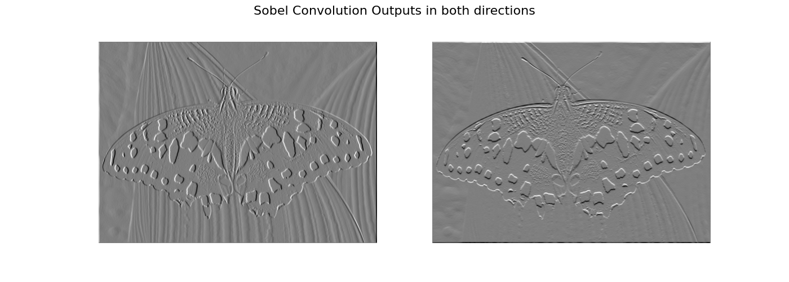

# Canny Edge Detection and Blob Detection

<p align="center">
  
</p>

[](LICENSE)
[](https://github.com/username/project/actions)

## Description
1. **_PartA_:**
  Canny Edge Detection from scratch

2. **_PartB_:**
   Blob Detection at different scales and rejection of Harris Corners.
 


## Table of Contents
- [Part A](#Part_A)
  - [Sobel Filters and Convolutions](#sobel-filters-and-convolutions)
  - [Non-Maxima-Supression](#non-maxima-supression)
  - [Canny Algorithm](#canny-algorithm)
  - [Installation](#installation)
  - [Execution](#execution)
- [Part B](#part-b)
  - [Difference of Gaussians](#difference-of-gaussians)
  - [Non-Maxima-Supression Across Scales](#non-maxima-supression-across-scales)
- [License](#license)

## Part_A

### Sobel Filters and Convolutions

We are first given a simple image like:

<p align="center">
  
</p>

Then, we want to convolve the image with SobelX and SobelY filters to acquire the gradients along the two dimensions. The Sobel filters are of the following form:

<p align="center">
  
</p>
### Template Matching and Normalized Cross Correlation (NCC)

After having cropped the images we perform zero-padding and we get the matching coordinates by finding the maximum NCC score while sliding one image on top of the other across x-y axes.

For a given alignment the NCC metric is given by:

<div align="center" style="font-size: 20px;">

$$
NCC = \sum_{i=1}^{W} \sum_{j=1}^{H} \frac{I_1(i, j) - \mu_1}{\sigma_1} * \frac{I_2(i, j) - \mu_2}{\sigma_2}
$$

</div>

, where: 
<div align="center" style="font-size: 12px;">
  
$$
H, W: \text{are the image Height and Width}
$$

</div>

<div align="center" style="font-size: 12px;">
  
$$I_1, I_2: \text{are the two Images}$$

</div>

<div align="center" style="font-size: 12px;">
  
$$ \mu_1, \mu_2, \sigma_1, \sigma_2: \text{are the two Image mean and std values}$$

</div>

### Results

Having found the matching image coordinates we append them together to from a single RGB 3-Channel Image. A sample results is as follows:

<p align="center">
  
</p>

### Installation

First create a virual environment by running:

1. Using _Conda_:
  ```bash
  conda create <your_environment_name>
  ```
2. Using _venv_
```bash
python -m venv <your_environment_name>
```

Then, activate your environment:

1. Using _Conda_:
  ```bash
  conda activate <your_environment_name>
  ```

2. Using _venv_:
   ```bash
   cd <your_environment_name>/bin
   source ./activate ## For Linux
   cd ../..
   ```
   or
   ```bash
    cd <your_environment_name>/Scripts
    activate  ## For Windows
    cd ../..
   ```

 Finally, install the requirements.txt file:

 ```bash
 pip install -r requirements.txt
 ```

### Execution

Run:
```bash
python get_rgb.py PartA/InputImages/01112v.jpg <your_output_folder>
```
To reproduce the result above or

```bash
python get_rgb.py path/to/your/image output_folder_name
```
if you want to provide your own image.


## Part B

### An Input sample

<p align="center">
  
</p>

### Otsu's thresholding

The first part of instance segmentation is using Otsu's thresholding method to get a pixel-intensity threshold, fine tuned in a way that leads to maximum cluster separation

The output image after perform Otsu's thresholding is the following:

<p align="center">
  
</p>

### Morphological Filtering

We then perform Morphological filtering by means of erosion and dilation to fill in any holes and give the thresholded values a high connectivity. The result of the above filtering process is as follows:

<p align="center">
  
</p>

### Connected Components

Then, a connected-component algorithm using either 4-connectivity or 8-connectivity kernels is implemented to identify the distinct objects present in the image, leading to the following masks:

<p align="center">
  
</p>

<p align="center">
  
</p>

### Hue moments, dominant orientations and Centroids

Hue moments are used to identify the main object axes and centroids as follows:

<p align="center">
  
</p>


### Installation

First create a virual environment by running:

1. Using _Conda_:
  ```bash
  conda create <your_environment_name>
  ```
2. Using _venv_
```bash
python -m venv <your_environment_name>
```

Then, activate your environment:

1. Using _Conda_:
  ```bash
  conda activate <your_environment_name>
  ```

2. Using _venv_:
   ```bash
   cd <your_environment_name>/bin
   source ./activate ## For Linux
   ```
   or
   ```bash
    cd <your_environment_name>/Scripts
    ./activate  ## For Windows
   ```

 Finally, install the requirements.txt file:

 ```bash
 pip install -r requirements.txt
 ```

### Execution

Run:
```bash
python instance_segmentation.py PartB/can.jpg <your_output_folder>
```
To reproduce the result above or

```bash
python instance_segmentation.py path/to/your/image output_folder_name
```
if you want to provide your own image.
